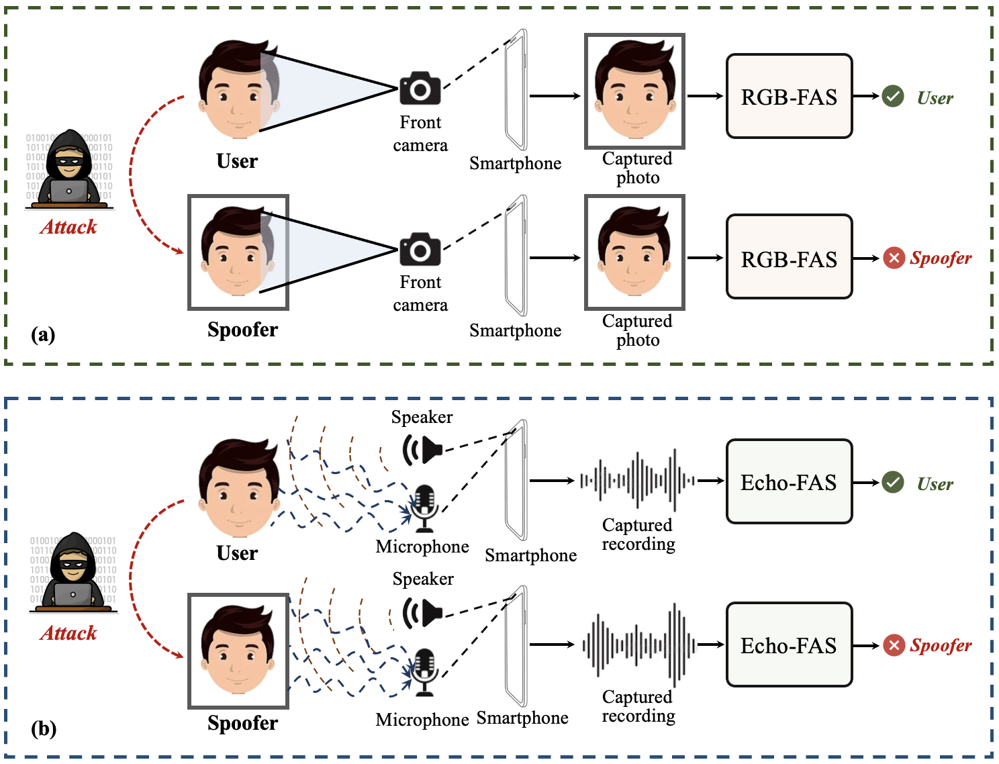

# Introduction
**Pytorch implementation of *"Beyond the Pixel World: A Novel Acoustic-based Face Anti-Spoofing System for Smartphones".* (IEEE TIFS 2022)**
<p align="center">
 
</p>
Illustration of M$^3$FAS system. The mobile device employs the front camera to capture the input RGB face photo. Meanwhile, the top speaker emits a customized acoustic signal, and the microphone collects the reflected signal modulated by the live/spoof face. The captured face picture and acoustic recording are sequentially fed forward to M$^3$FAS for final decision-making.

# Framework
<p align="center">
 
</p>
Overview of the proposed two-branch Echo-FAS pipeline. The input signal is firstly fed forward to the Signal preprocessing module to extract nine signal segments. In the first branch, we apply Fast Fourier Transform (FFT) to obtain nine frequency signals, which are regarded as nine tokens and will be sent to the Transformer to obtain the global frequency feature. In the second branch, we further employ Short Time Fourier Transform (STFT) to obtain the corresponding spectrogram to the processed signal. The CNN is used to extract the local frequency feature of the input signals. The Cross Attention mechanisms model the correlation of the extracted global frequency feature $f_{1}$ and local frequency feature $f_{2}$. Subsequently, the attended features will be finally combined to determine whether the input query is a live person or a spoofer.

# App
Coming soon.

# Demo video
https://youtu.be/OoE5qFgwA54

# Dataset
If you would like to access the Echo-Spoof dataset, please fill out this [Google Form](https://docs.google.com/forms/d/e/1FAIpQLSf6ZAw5MO2awdF-qzHFv_yv5vXsu76VyQ0I8Mr3DP7CoKghPw/viewform?usp=sf_link). The download link will be sent to you once the form is accepted. 

# Usage
1. Download Echo-Spoof database.  
2. implement "python train_fusion.py" for reproducing the results. (change the training, validation, and test csv paths for different phones.)  
3. implement "python test_fusion.py" for inference and evaluation. (change the test csv path and model path accordingly.)  


# FAS detection results for different smartphones
|  Phone   | AUC(%) | ACC(%)| HTER(%) | EER(%) | 
|:--------|:--------:|:--------:|:--------:|:--------:|
|Note|98.12|92.93|7.07|6.09|
|S9|99.86|97.57|2.43|1.24|
|S21|97.37|92.69|7.32|8.12|
|Xiaomi|99.81|97.51|2.45|2.14|
|AVG|98.79|95.18|4.83|4.34|

# Prerequisites:
+ torch: 1.5.0  
+ torchvision: 0.6.0  
+ numpy: 1.23.0  
+ pandas: 1.0.5


# Citation
```
@article{kong2022beyond,
  title={Beyond the Pixel World: A Novel Acoustic-based Face Anti-Spoofing System for Smartphones},
  author={Kong, Chenqi and Zheng, Kexin and Wang, Shiqi and Rocha, Anderson and Li, Haoliang},
  journal={IEEE Transactions on Information Forensics and Security},
  year={2022},
  publisher={IEEE}
}
 ```
